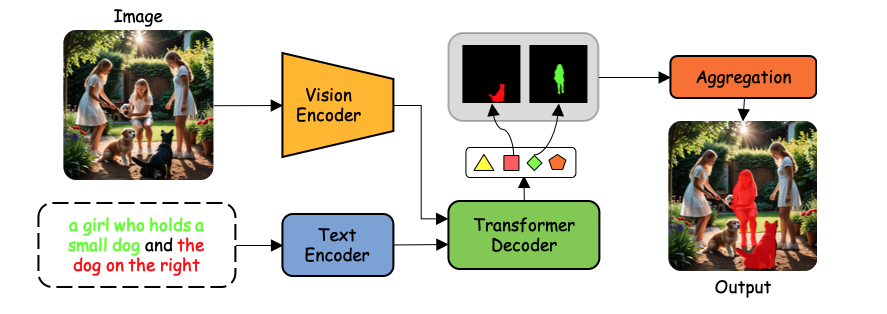

# Phrase-Instance Alignment for Generalized Referring Segmentation

[E-Ro Nguyen](https://eronguyen.me), [Hieu Le](https://hieulem.github.io/), [Dimitris Samaras](https://scholar.google.com/citations?user=BxbKTYkAAAAJ&hl=en), [Michael S Ryoo](http://michaelryoo.com)

Stony Brook University, University of North Carolina at Charlotte

<a href="">
  
</a>
<a href='https://arxiv.org/abs/2411.15087'></a>
<a href='https://github.com/nero1342/InstAlign'></a>
<a href='https://eronguyen.github.io/InstAlign/'></a>

<p align="center">
  
</p>

**InstAlign** is an instance-aware framework for generalized referring expression segmentation that explicitly aligns semantic phrases in the input text with object instances in the image before producing the final segmentation mask.

---

## 🔥 Updates

- **[March 2026]** Accepted at **CVPR 2026 Workshop: Pixel-level Video Understanding in the Wild**

---

## 🔧 Code

🚀 Code & pretrained checkpoints will be released soon!

## Citation

If you find our work useful, please consider citing:

```bibtex
@article{instalign,
  title   = {Phrase-Instance Alignment for Generalized Referring Segmentation},
  author  = {Nguyen, E-Ro and Le, Hieu and Samaras, Dimitris and Ryoo, Michael},
  journal = {Proceedings of the IEEE/CVF Conference on Computer Vision and Pattern Recognition (CVPR) Workshops},
  year    = {2026}
}
```
